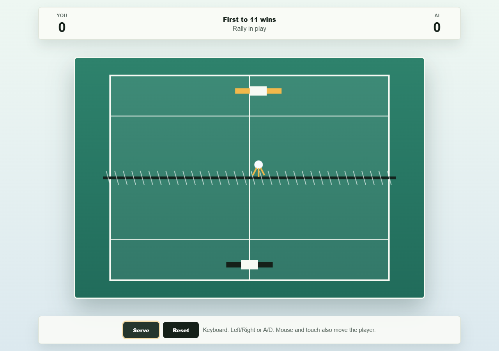
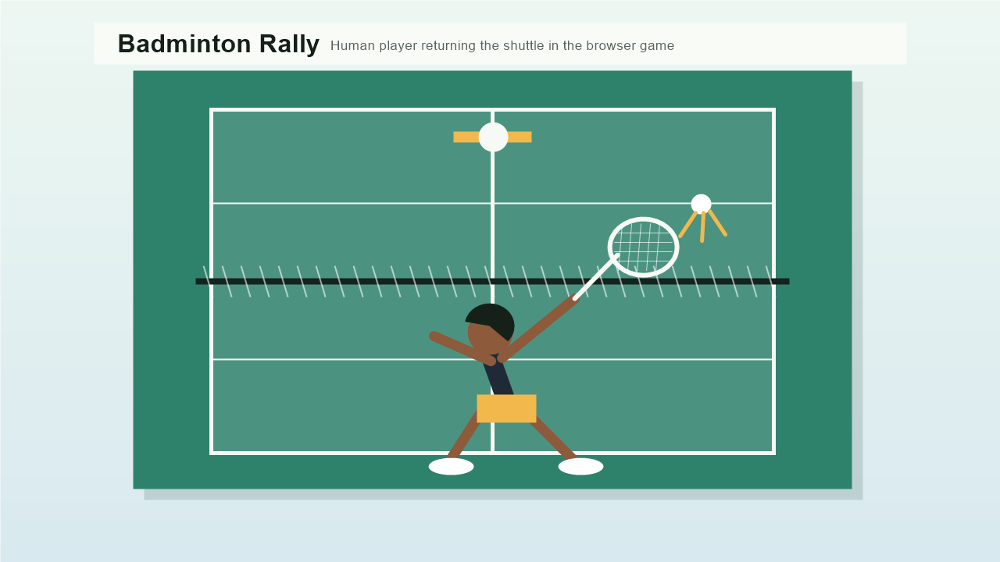

# Badminton Rally

Badminton Rally is a small browser game built for an AI-native software development challenge. The player controls the lower racket, rallies against a simple AI opponent, and wins by reaching 11 points first.

## Game Description

Move the player racket left and right to return the shuttle. The AI controls the top racket and tracks the shuttle with limited speed, so angled returns can beat it. A point is awarded when either side misses or sends the shuttle out of play.

## Screenshots





## Setup

No install step is required to play the game. Install Node.js 18 or newer only if you want to run the tests.

## Run

Open `index.html` in a browser, or serve the folder with any static web server.

```bash
python -m http.server 4173
```

Then visit `http://127.0.0.1:4173`.

Controls:

- Left/Right arrows or A/D move the player.
- Mouse or touch moves the player directly.
- Space, Serve, or tapping the court starts a rally.
- Reset starts a new match.

## Test

```bash
npm test
```
